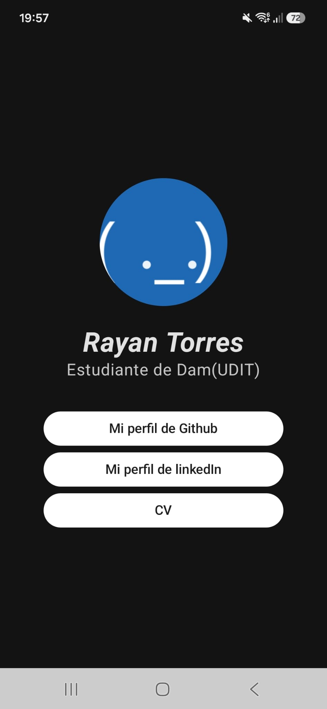
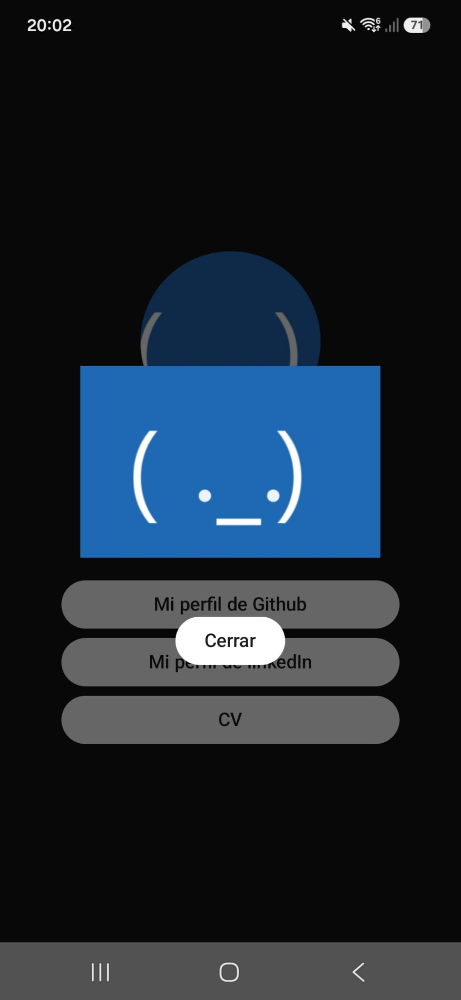

# Reto 1 · Tarjeta de Presentación Profesional

**Módulo:** 0489 · Programación Multimedia y Dispositivos Móviles
**Autor:** Rayan Torres
**Tecnología:** Kotlin + Jetpack Compose (Android nativo)
**RA vinculado:** RA1 · Tecnologías de desarrollo para dispositivos móviles

## 📱 Qué es esta app

Una tarjeta de presentación digital (estilo Linktree) que muestra una foto de perfil, el nombre y el rol profesional del autor. Incluye botones para abrir sus perfiles de GitHub y LinkedIn, además de un botón «CV» que muestra un diálogo.

## 📸 Capturas de pantalla

| Tarjeta de presentación | Diálogo del botón «CV» |
|---|---|
|  |  |

(En lugar de esta segunda imagen debería ir un código QR.)

## 🎯 Objetivo del reto

Partir de un proyecto Android base y modificarlo para construir una aplicación funcional propia, aplicando los conceptos vistos en clase: estructura de un proyecto Kotlin, componentes visuales de Jetpack Compose, gestión de recursos (imágenes e icono) y control de versiones con Git.

## 🛠️ Componentes y conceptos utilizados

| Componente / concepto | Para qué se usa en esta app |
|---|---|
| `Column` | Organiza los elementos en vertical (foto, nombre, rol y botones) |
| `Image` + `clip(CircleShape)` | Muestra la foto de perfil recortada en círculo |
| `Text` | Nombre y rol profesional |
| `Spacer` | Separación entre elementos |
| `Button` + `Intent` + `Uri` | Abre los perfiles de GitHub y LinkedIn en el navegador |
| `remember` + `mutableStateOf` + `Dialog` | Controla la visibilidad del diálogo del botón «CV» |
| `res/drawable` | Carpeta donde vive la imagen de perfil |
| `res/mipmap` (Image Asset Studio) | Icono personalizado de la app, sustituyendo al robot de Android por defecto |
| `strings.xml` (`app_name`) | Nombre visible de la app bajo el icono, en el móvil |

## 🚀 Cómo ejecutar el proyecto

1. Clonar o abrir el proyecto en Android Studio.
2. Esperar a que sincronice Gradle.
3. Ejecutar (▶) sobre un emulador o un dispositivo Android real con la depuración USB activada.

## 🧠 Qué he aprendido

- He aprendido a organizar una interfaz Android con Kotlin y Jetpack Compose, usando componentes como `Column`, `Image`, `Text`, `Spacer` y `Button`.
- He aprendido a cargar una imagen desde `res/drawable` y a recortarla en forma circular con `clip(CircleShape)`.
- He aprendido a abrir páginas externas con `Intent` y `Uri`, y a controlar la apertura y el cierre de un diálogo mediante estado de Compose.
- También he practicado la personalización del icono de la aplicación y de su nombre visible en el dispositivo.

## 🐞 Dificultades y cómo las resolví

Una de las partes que requirió más atención fue hacer que el botón «CV» mostrara y cerrara un diálogo sin salir de la pantalla. Lo resolví guardando su visibilidad en un estado con `remember` y `mutableStateOf`, y actualizando ese estado tanto al abrir como al cerrar el diálogo. Para los perfiles, utilicé `Intent.ACTION_VIEW` con la URL correspondiente.

## 📂 Estructura del proyecto

```
app/src/main/java/.../MainActivity.kt   → pantalla principal (Compose)
app/src/main/res/drawable/              → imagen de perfil
app/src/main/res/mipmap-*/              → icono de la app
app/src/main/res/values/strings.xml     → nombre visible de la app
```

## 🔗 Enlace

- GitHub: [github.com/Rayan-t-t](https://github.com/Rayan-t-t)
- LinkedIn: [linkedin.com/in/rayan-torres-torres](https://linkedin.com/in/rayan-torres-torres)
